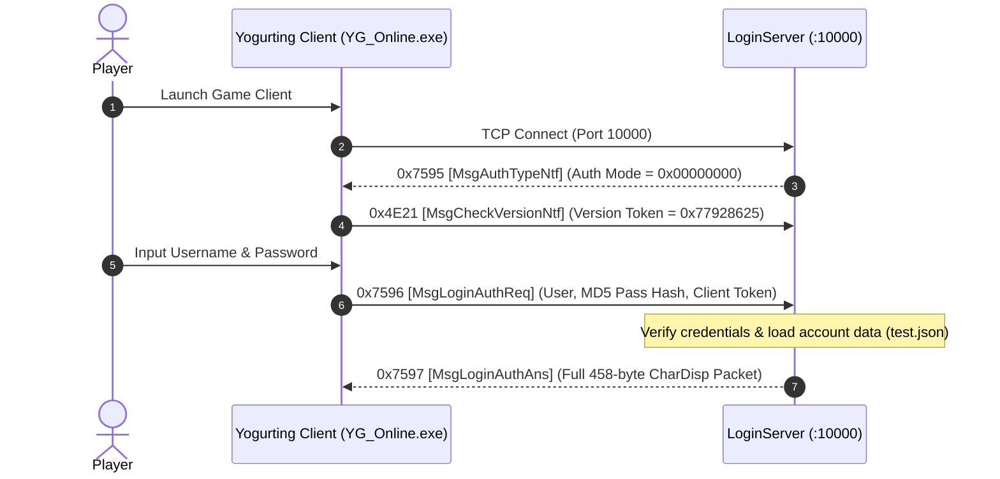

# Volume 2, Chapter 1: Authentication & Login Handshake (0x7595 / 0x7596)

## 1. Overview & Connection Lifecycle

The authentication phase is the initial handshake executed when the Yogurting client establishes a TCP connection to the **LoginServer** on port **`10000`**.



---

## 2. Opcode 0x7595 (30101): `MsgAuthTypeNtf` [認証方式通知]

* **Direction**: Server $\longrightarrow$ Client
* **Port**: `10000 (LoginServer)`
* **Delphi Class**: `TMsgAuthTypeNtf` (`_Unit47.pas:005AA9A4`)
* **AnaYg Script**: [`30101.dms`](../dms/30101.dms)

### Memory Layout Table (4 Bytes Payload)

| Offset | Field Name | Type | Size | Description | Example Values |
| :--- | :--- | :--- | :--- | :--- | :--- |
| `0x00` (`+0`) | `authType` | `UInt32` | 4B | Authentication Type / Security Mode | `0x00000000` (Standard User/Pass Auth) |

### AnaYg Script (`30101.dms`)
```javascript
function parse(packet){
    with(packet){
        setTitle("認証方式通知");
        readUInt32("認証タイプ");
    }
}
```

### Live Hex Capture
```hex
04 00 00 00  -> Length Prefix: 4 bytes payload
95 75        -> Opcode: 0x7595 (30101)
00 00 00 00  -> Payload: authType = 0
```

---

## 3. Opcode 0x7596 (30102): `MsgLoginAuthReq` [ログイン認証要求]

* **Direction**: Client $\longrightarrow$ Server
* **Port**: `10000 (LoginServer)`
* **Delphi Class**: Handled in `TSession.sub_006BEEA8` (`_Unit67.pas`)
* **AnaYg Script**: [`30102.dms`](../dms/30102.dms)

### Memory Layout Table (88 Bytes Payload)

| Offset | Field Name | Type | Size | Description | Example Values |
| :--- | :--- | :--- | :--- | :--- | :--- |
| `0x00` (`+0`) | `userName` | `WStr[25]` | 50B | UTF-16LE Username string with null padding | `"test\0\0..."` |
| `0x32` (`+50`) | `passwordHash`| `Char[32]` | 32B | 32-character ASCII MD5 hash of user's password | `"098f6bcd4621d373cade4e832627b4f6"` |
| `0x52` (`+82`) | `clientToken` | `UInt16` | 2B | Internal client session token | `0x0000` |
| `0x54` (`+84`) | `authKey` | `Int32` | 4B | Account Auth Key / Web SSO cookie | `-1` (`0xFFFFFFFF`) for direct login |

### AnaYg Script (`30102.dms`)
```javascript
function parse(packet){
    with(packet){
        setTitle("ログイン認証要求");
        readWStr(0x32, "ユーザID");
        readStr(0x20, "パスワード");
        readWord("Unknown");
        readInt32("Unknown");
    }
}
```

### Live Hex Capture
```hex
58 00 00 00  -> Length Prefix: 88 bytes (0x58) payload
96 75        -> Opcode: 0x7596 (30102)
Payload (88B):
74 00 65 00 73 00 74 00 00 00 00 00 ... (50B Username = "test")
30 39 38 66 36 62 63 64 34 36 32 31 ... (32B MD5 Password Hash)
00 00                                   (2B Client Token)
FF FF FF FF                             (4B Auth Key = -1)
```
