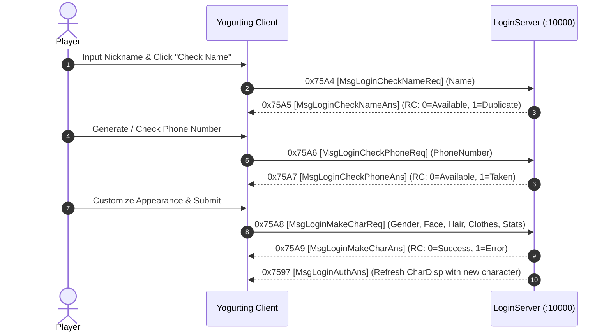

# Volume 2, Chapter 3: Character Creation, Deletion & Name Validation

## 1. Character Creation Workflow

When an account has no active character (`HasCharacter = false`), the client enters the Character Creator scene:

---

## 2. Opcode 0x75A4 (30116): `MsgLoginCheckNameReq` / `Ans` (0x75A5)

* **AnaYg Scripts**: [`30116.dms`](../dms/30116.dms), [`30117.dms`](../dms/30117.dms)
* **Delphi Handlers**: `TSchoolSession.sub_006BEFC0`, `TMsgLoginCheckCharNameAns.Create` (`0x005AAD20`)

### `MsgLoginCheckNameReq` (0x75A4 / 28 Bytes Payload)
| Offset | Field Name | Type | Size | Description |
| :--- | :--- | :--- | :--- | :--- |
| `0x00` | `name` | `WStr[13]` | 26B | Requested Character Nickname (UTF-16LE, null padded) |
| `0x1A` | `padding` | `Byte[2]` | 2B | Alignment padding |

### `MsgLoginCheckNameAns` (0x75A5 / 4 Bytes Payload)
| Offset | Field Name | Type | Size | Description |
| :--- | :--- | :--- | :--- | :--- |
| `0x00` | `returnCode` | `UInt32` | 4B | `0x00000000` = Name Available, `0x00000001` = Name Already Taken |

---

## 3. Opcode 0x75A8 (30120): `MsgLoginMakeCharReq` [キャラクター作成要求]

* **Direction**: Client $\longrightarrow$ Server
* **Port**: `10000 (LoginServer)`
* **Delphi Handler**: `TSchoolSession.sub_006BF098`
* **AnaYg Script**: [`30120.dms`](../dms/30120.dms)

### Memory Layout Table (116 Bytes Payload)

| Offset | Field Name | Type | Size | Description | Valid Values |
| :--- | :--- | :--- | :--- | :--- | :--- |
| `0x00` | `name` | `WStr[13]` | 26B | Final Character Nickname | UTF-16LE String |
| `0x1A` | `phone` | `UInt32` | 4B | Assigned In-game Phone Number | 8-digit Integer |
| `0x1E` | `school` | `Byte` | 1B | Selected Academy | `1` = Estiva, `2` = So-il |
| `0x1F` | `gender` | `Byte` | 1B | Gender | `1` = Male, `2` = Female |
| `0x20` | `faceId` | `Byte` | 1B | Face Preset | `1` – `48` |
| `0x21` | `hairId` | `Byte` | 1B | Hair Preset | `1` – `48` |
| `0x22` | `skinColor` | `Byte` | 1B | Skin Tone | `1` – `8` |
| `0x23` | `hairColor` | `Byte` | 1B | Hair Color | `1` – `8` |
| `0x24` | `birthMonth` | `Byte` | 1B | Birthday Month | `1` – `12` |
| `0x25` | `birthDay` | `Byte` | 1B | Birthday Day | `1` – `31` |
| `0x26` | `bloodType` | `Byte` | 1B | Blood Type | `1`=A, `2`=B, `3`=O, `4`=AB |
| `0x27` | `padding` | `Byte` | 1B | Alignment padding | `0x00` |
| `0x28` | `starterItems[9]` | `Int32[9]` | 36B | Selected Starter Clothing Type IDs | Uniform Top, Bottom, Shoes |
| `0x4C` | `starterWeapons[4]`| `Int32[4]` | 16B | Starter Weapon Selection | Blade, Glove, Blunt, Spirit |
| `0x5C` | `initialStats[7]` | `Int32[7]` | 28B | Base Stat Allocations | POW, DEX, SPI, INT, LUK |

---

## 4. Opcode 0x75AA (30122): `MsgLoginDeleteCharReq` / `Ans` (0x75AB)

* **AnaYg Scripts**: [`30122.dms`](../dms/30122.dms), [`30123.dms`](../dms/30123.dms)
* **Delphi Handlers**: `TSchoolSession.sub_006BF1A0`, `TMsgLoginDeleteCharAns.Create` (`0x005AAE30`)

### `MsgLoginDeleteCharReq` (0x75AA / 8 Bytes Payload)
| Offset | Field Name | Type | Size | Description |
| :--- | :--- | :--- | :--- | :--- |
| `0x00` | `characterId` | `Int32` | 4B | Character Database ID to delete |
| `0x04` | `deletionCode` | `UInt32` | 4B | Confirmation PIN / Auth check |

### `MsgLoginDeleteCharAns` (0x75AB / 4 Bytes Payload)
| Offset | Field Name | Type | Size | Description |
| :--- | :--- | :--- | :--- | :--- |
| `0x00` | `returnCode` | `UInt32` | 4B | `0x00000000` = Character Deleted Successfully |
