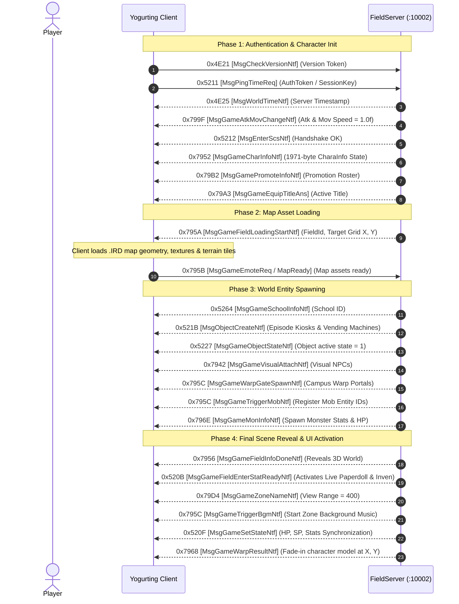

# Volume 3, Chapter 1: 3D Field Loading Lifecycle & Handshake

## 1. Field Entry & Loading State Machine

When a player enters a campus or hunt field (either upon logging in or warping through a portal), the client and FieldServer execute an exact 10-step synchronization sequence:

---

## 2. Key Packet Specifications

### 1. Opcode 0x795A (31066): `MsgGameFieldLoadingStartNtf`
* **Direction**: Server $\longrightarrow$ Client
* **Delphi Class**: `TMsgGameFieldLoadingStartNtf` (`_Unit47.pas:005AD514`)
* **Payload (20 Bytes)**:
  * `0x00`: `Int32 charaId`
  * `0x04`: `Int32 fieldId` (e.g. `91` for Estiva Plaza, `399` for Hunt Field)
  * `0x08`: `UInt16 targetX`
  * `0x0A`: `UInt16 targetY`
  * `0x0C`: `UInt16 destX`
  * `0x0E`: `UInt16 destY`
  * `0x10`: `Int32 padding` (`0xCCCCCCCC`)

---

### 2. Opcode 0x7956 (31062): `MsgGameFieldInfoDoneNtf`
* **Direction**: Server $\longrightarrow$ Client
* **Delphi Class**: `TMsgGameFieldInfoDoneNtf` (`_Unit47.pas:005AD4B8`)
* **Payload (4 Bytes)**: `0x00000000` (or CRT fill `0xCCCCCCCC`)
* **Function**: Signals to the client engine that all world entities (NPCs, gates, kiosks) have been spawned and instructs the 3D renderer to lift the black loading screen.

---

### 3. Opcode 0x520B (21003): `MsgGameFieldEnterStatReadyNtf`
* **Direction**: Server $\longrightarrow$ Client
* **Delphi Class**: `TMsgGameFieldEnterStatReadyNtf` (`_Unit47.pas:005A9344`)
* **Payload (4 Bytes)**: `Float32 rate` (Standard value = `0.3f` / Hex `9A 99 99 3E`)
* **Critical Client Effect**: **Activates the client's live inventory event listener and paperdoll rendering**. If this packet is omitted, equipping/unequipping items in the field will not update visually on the character!

---

### 4. Opcode 0x7968 (31080): `MsgGameWarpResultNtf`
* **Direction**: Server $\longrightarrow$ Client
* **Delphi Class**: `TMsgGameWarpResultNtf` (`_Unit47.pas:005ADF0C`)
* **Payload (8 Bytes)**:
  * `0x00`: `Int32 fieldId`
  * `0x04`: `UInt16 posX`
  * `0x06`: `UInt16 posY`
* **Function**: Performs the final camera unclamp and fades the player character in at destination coordinates `(posX, posY)`.
