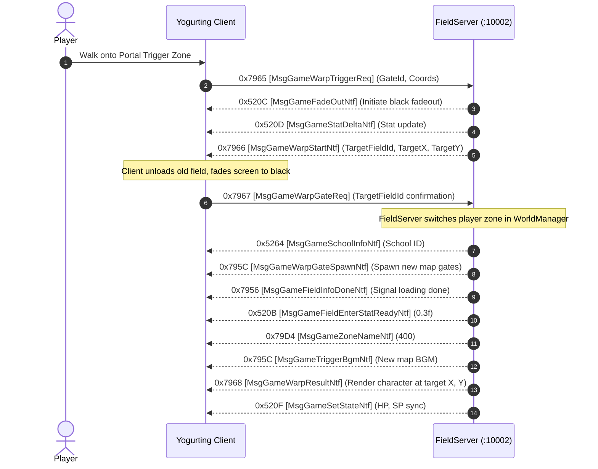

# Volume 3, Chapter 2: Warp Gates, Portals & Teleportation Protocol

## 1. Warp Portal Lifecycle State Machine

When a character steps into a portal trigger area (e.g. Gate 5 in Estiva Plaza to enter Mob Field 399), the following sequence executes:

---

## 2. Opcode Specifications

### 1. Opcode 0x7965 (31077): `MsgGameWarpTriggerReq` [ワープトリガー要求]
* **Direction**: Client $\longrightarrow$ Server
* **Delphi Handler**: `TSchoolSession.sub_006C13F8`
* **AnaYg Script**: [`31077.dms`](../dms/31077.dms)
* **Payload (8 Bytes)**:
  * `0x00`: `Int32 unk1` (`0x00000000` or Entity ID)
  * `0x04`: `Byte gateId` (e.g. `5` for Gate 5, `2` for Gate 2)
  * `0x05`: `Byte[3] triggerHash` (Internal client positional checksum)

---

### 2. Opcode 0x520C (21004): `MsgGameFadeOutNtf` [フェードアウト通知]
* **Direction**: Server $\longrightarrow$ Client
* **Delphi Class**: `TMsgGameFadeOutNtf` (`_Unit47.pas:005A9380`)
* **Payload (0 Bytes)**: Zero-payload packet (Total 6 bytes on wire: `00 00 00 00 0C 52`).
* **Function**: Tells client to smoothly fade the 3D viewport to black.

---

### 3. Opcode 0x7966 (31078): `MsgGameWarpStartNtf` [ワープ開始通知]
* **Direction**: Server $\longrightarrow$ Client
* **Delphi Class**: `TMsgGameWarpAns` (`_Unit47.pas:005ADE60`)
* **Payload (20 Bytes)**:
  * `0x00`: `Int32 charaId`
  * `0x04`: `Int32 targetFieldId` (e.g. `399`)
  * `0x08`: `UInt16 targetGridX` (e.g. `58`)
  * `0x0A`: `UInt16 targetGridY` (e.g. `17`)
  * `0x0C`: `Int32 channelId` (`1`)
  * `0x10`: `Int32 durationMs` (`15` ms)

---

### 4. Opcode 0x7967 (31079): `MsgGameWarpGateReq` [ワープゲート要求]
* **Direction**: Client $\longrightarrow$ Server
* **Payload (8 Bytes)**:
  * `0x00`: `Int32 unk`
  * `0x04`: `Int32 targetFieldId` (Confirms to server that client loaded the new map)

---

## 3. Verified Field 91 $\longleftrightarrow$ Field 399 Gate Geometry

| Map ID | Name | Gate ID | Portal Coordinate | Landing / Arrival Coordinate | Destination Map | Destination Landing |
| :--- | :--- | :--- | :--- | :--- | :--- | :--- |
| **Field 91** | Estiva Campus Plaza | **Gate 5** | `(223.5, 102.5)` | `(220, 99)` | **Field 399** | `(58, 17)` |
| **Field 399** | Hunt Zone HF200201 | **Gate 2** | `(58, 14.5)` | `(58, 17)` | **Field 91** | `(220, 99)` |
