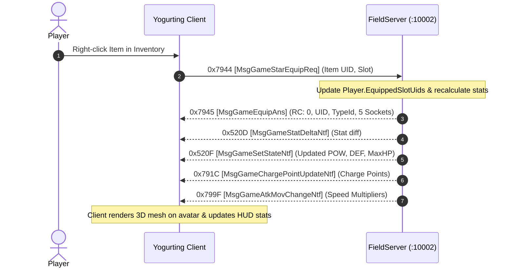

# Volume 4, Chapter 3: Equip & Unequip Workflows & Live Paperdoll Sync

## 1. Equipment State Machine

When a player equips or unequips an item in real-time, the client and server exchange a synchronized burst of state update packets:

---

## 2. Opcode Specifications

### 1. Opcode 0x7944 (31044): `MsgGameStarEquipReq` / `0x7945` (31045): `MsgGameEquipAns`
* **Direction**: Client $\longrightarrow$ Server (`0x7944`) / Server $\longrightarrow$ Client (`0x7945`)
* **AnaYg Scripts**: [`31044.dms`](../dms/31044.dms), [`31045.dms`](../dms/31045.dms)
* **Delphi Handlers**: `TSchoolSession.sub_006C10B0`, `TMsgGameEquipAns.Create` (`0x005ACBA0`)

#### `MsgGameEquipAns` Payload (40 Bytes / 46 Bytes Wire):
| Offset | Field Name | Type | Size | Description |
| :--- | :--- | :--- | :--- | :--- |
| `0x00` | `returnCode` | `Int32` | 4B | `0x00000001` = Success |
| `0x04` | `charaId` | `Int32` | 4B | Player Character ID |
| `0x08` | `itemUid` | `Int32` | 4B | Equipped Item Instance UID |
| `0x0C` | `slotIndex` | `Int32` | 4B | Target Paperdoll Slot (`0` to `11`) |
| `0x10` | `typeId` | `Int32` | 4B | Item Type ID from `ItemTable.txt` |
| `0x14` | `reinforce1` | `Int32` | 4B | Socket 1 Stone Type ID (0 if empty) |
| `0x18` | `reinforce2` | `Int32` | 4B | Socket 2 Stone Type ID (0 if empty) |
| `0x1C` | `reinforce3` | `Int32` | 4B | Socket 3 Stone Type ID (0 if empty) |
| `0x20` | `reinforce4` | `Int32` | 4B | Socket 4 Stone Type ID (0 if empty) |
| `0x24` | `reinforce5` | `Int32` | 4B | Socket 5 Stone Type ID (0 if empty) |

---

### 2. Opcode 0x7946 (31046): `MsgGameUnequipReq` / `0x7947` (31047): `MsgGameUnequipAns`
* **Direction**: Client $\longrightarrow$ Server (`0x7946`) / Server $\longrightarrow$ Client (`0x7947`)
* **AnaYg Scripts**: [`31046.dms`](../dms/31046.dms), [`31047.dms`](../dms/31047.dms)
* **Delphi Handlers**: `TSchoolSession.sub_006C11E4`, `TMsgGameUnequipAns.Create` (`0x005ACC2C`)

#### `MsgGameUnequipAns` Payload (20 Bytes / 26 Bytes Wire):
| Offset | Field Name | Type | Size | Description |
| :--- | :--- | :--- | :--- | :--- |
| `0x00` | `returnCode` | `Int32` | 4B | `0x00000001` = Success |
| `0x04` | `charaId` | `Int32` | 4B | Player Character ID |
| `0x08` | `itemUid` | `Int32` | 4B | Unequipped Item Instance UID |
| `0x0C` | `slotIndex` | `Int32` | 4B | Paperdoll Slot unequipped (`0` to `11`) |
| `0x10` | `typeId` | `Int32` | 4B | Item Type ID returning to inventory |

---

### 3. Star Item Handshakes (`0x5265` / `0x5266` / `0x5267` / `0x5268`)

For Star / Cash items, the client utilizes the `0x5200` series opcodes:
* **Equip Star Item**: `MsgGameEquipByulBeItemReq` (`0x5265`) $\rightarrow$ `MsgGameEquipByulBeItemAns` (`0x5266`) $\rightarrow$ `MsgGameUseByulBeItemStartNtf` (`0x5269`).
* **Unequip Star Item**: `MsgGameStripByulBeItemReq` (`0x5267`) $\rightarrow$ `MsgGameStripByulBeItemAns` (`0x5268`).
