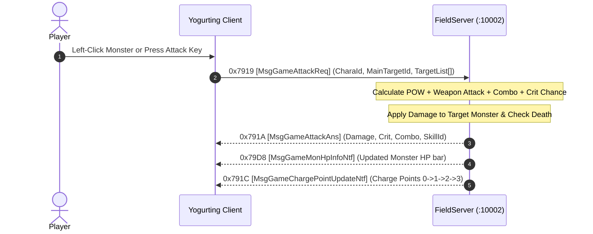

# Volume 5, Chapter 1: Player Attack Packets & Multi-Target Resolution

## 1. Combat Interaction Flow

When a player clicks or presses an attack hotkey, the client transmits an attack request containing the primary target and an array of adjacent splash targets:



---

## 2. Opcode 0x7919 (31001): `MsgGameAttackReq` [攻撃要求]

* **Direction**: Client $\longrightarrow$ Server
* **Port**: `10002 (FieldServer)`
* **Delphi Handler**: `TSchoolSession.sub_006C17DC`
* **AnaYg Script**: [`31001.dms`](../dms/31001.dms)

### Memory Layout Table (Variable Size: 24 Bytes Header + $N \times 16$ Bytes Targets)

| Offset | Field Name | Type | Size | Description | Example Values |
| :--- | :--- | :--- | :--- | :--- | :--- |
| `0x00` | `idChar` | `Int32` | 4B | Attacking Player Character ID | `256`, `1001` |
| `0x04` | `idxAtkSkill` | `Byte` | 1B | Attack Skill Index / Normal Swing (`0`) | `0` |
| `0x05` | `targetMainType` | `Int32` | 4B | Target Entity Category (`2` = Monster) | `2` |
| `0x09` | `targetMainId` | `Int32` | 4B | Primary Target Entity ID (`-1` = Empty Air) | `1`, `-1` |
| `0x0D` | `targetMainPosX`| `Int32` | 4B | Primary Target Grid X Coordinate | `64` |
| `0x11` | `targetMainPosY`| `Int32` | 4B | Primary Target Grid Y Coordinate | `36` |
| `0x15` | `cntTarget` | `Byte` | 1B | Target Category Count | `1` |
| `0x16` | `TargetsCount` | `UInt16` | 2B | Number of secondary targets in array | `0`, `1`, `3` |

### Target Array Item Format (16 Bytes each):
```text
Offset +0:  Int32 targetType  (2 = Monster)
Offset +4:  Int32 targetId    (Monster Entity ID)
Offset +8:  Int32 targetPosX  (Grid X)
Offset +12: Int32 targetPosY  (Grid Y)
```

---

## 3. Opcode 0x791A (31002): `MsgGameAttackAns` [攻撃返答]

* **Direction**: Server $\longrightarrow$ Client (Broadcasted to all nearby players in zone)
* **Delphi Class**: `TMsgGameAttackAns` (`_Unit47.pas:005AD744`)
* **AnaYg Script**: [`31002.dms`](../dms/31002.dms)

### Memory Layout Table (52 Bytes Payload)

| Offset | Field Name | Type | Size | Description | Example Values |
| :--- | :--- | :--- | :--- | :--- | :--- |
| `0x00` | `attackerCharaId`| `Int32` | 4B | Attacking Player Character ID | `256` |
| `0x04` | `targetEntityId` | `Int32` | 4B | Hit Target ID (`-1` for missed swing) | `1` |
| `0x08` | `targetPosX` | `Int32` | 4B | Floating damage numbers rendering X | `64` |
| `0x0C` | `targetPosY` | `Int32` | 4B | Floating damage numbers rendering Y | `36` |
| `0x10` | `damage` | `Int32` | 4B | Final damage dealt to target | `85` |
| `0x14` | `isCritical` | `Int32` | 4B | Critical Hit Flag (`1` = CRIT! Yellow text) | `0` or `1` |
| `0x18` | `comboCount` | `Int32` | 4B | Current Active Combo Streak (1..999) | `42` |
| `0x1C` | `weaponCategory`| `Int32` | 4B | `1`=Blade, `2`=Glove, `3`=Blunt, `4`=Spirit | `1` |
| `0x20` | `skillId` | `Int32` | 4B | Attack Animation ID (`215` = Normal Swing) | `215` |
| `0x24` | `addDexExp` | `Int32` | 4B | Weapon Proficiency EXP awarded | `1` |
| `0x28` | `padding` | `Byte[12]` | 12B | CRT alignment padding | `0xCC...` |
