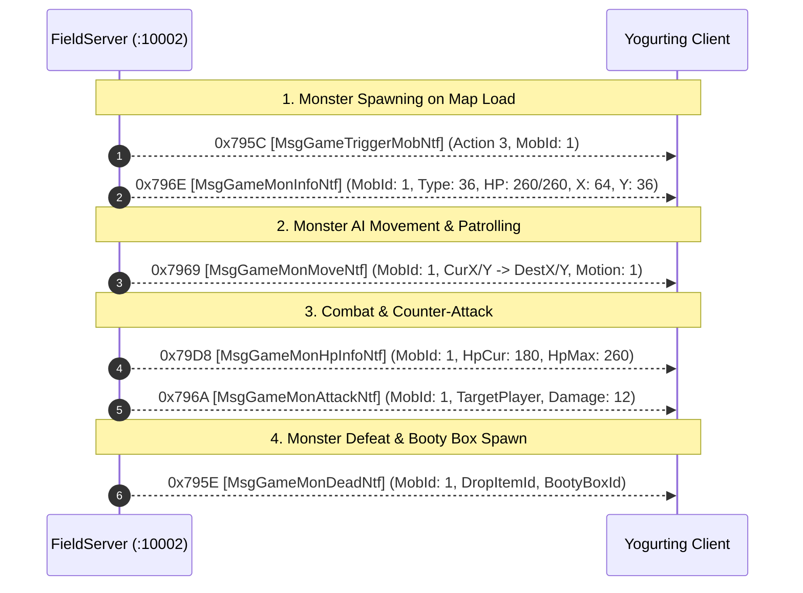

# Volume 5, Chapter 2: Monster Spawns, Movement & Death Lifecycle

## 1. Monster Lifecycle Protocol

---

## 2. Opcode Specifications

### 1. Opcode 0x796E (31086): `MsgGameMonInfoNtf` [モンスター情報通知]
* **Direction**: Server $\longrightarrow$ Client
* **Delphi Class**: `TMsgGameMonInfoNtf` (`_Unit47.pas:005AE1EC`)
* **AnaYg Script**: [`31086.dms`](../dms/31086.dms)
* **Payload (32 Bytes)**:
  * `0x00`: `Int32 idMonster` (Unique sequential Entity ID in current field)
  * `0x04`: `Int32 typeMonster` (Monster Type from `score/default.xml` / `UYgDB`)
  * `0x08`: `Int32 hpCurrent` (Current HP)
  * `0x0C`: `Int32 hpMax` (Max HP)
  * `0x10`: `UInt16 X` (Spawn Grid X)
  * `0x12`: `UInt16 Y` (Spawn Grid Y)
  * `0x14`: `Int32 dirX` (Facing Direction vector X)
  * `0x18`: `Int32 dirY` (Facing Direction vector Y)
  * `0x1C`: `Int32 bOwnership` (`1` = Aggroed onto player, `0` = Neutral)

---

### 2. Opcode 0x79D8 (31208): `MsgGameMonHpInfoNtf` [モンスターHP情報通知]
* **Direction**: Server $\longrightarrow$ Client (Broadcast)
* **Delphi Class**: `TMsgGameMonHpInfoNtf` (`_Unit47.pas:005AF3C8`)
* **AnaYg Script**: [`31208.dms`](../dms/31208.dms)
* **Payload (12 Bytes)**:
  * `0x00`: `Int32 idMonster`
  * `0x04`: `Int32 hpCurrent`
  * `0x08`: `Int32 hpMax`

---

### 3. Opcode 0x7969 (31081): `MsgGameMonMoveNtf` [モンスター移動通知]
* **Direction**: Server $\longrightarrow$ Client
* **Delphi Class**: `TMsgGameMonMoveNtf` (`_Unit47.pas:005ADF68`)
* **AnaYg Script**: [`31081.dms`](../dms/31081.dms)
* **Payload (20 Bytes)**:
  * `0x00`: `Int32 idMonster`
  * `0x04`: `UInt16 curX`
  * `0x06`: `UInt16 curY`
  * `0x08`: `UInt16 destX`
  * `0x0A`: `UInt16 destY`
  * `0x0C`: `Int32 motion` (`0` = Idle, `1` = Walk, `2` = Run)
  * `0x10`: `Byte speedRate` (`100` = 1.0x normal speed)
  * `0x11`: `Byte[3] padding` (`0xCC, 0xCC, 0xCC`)
