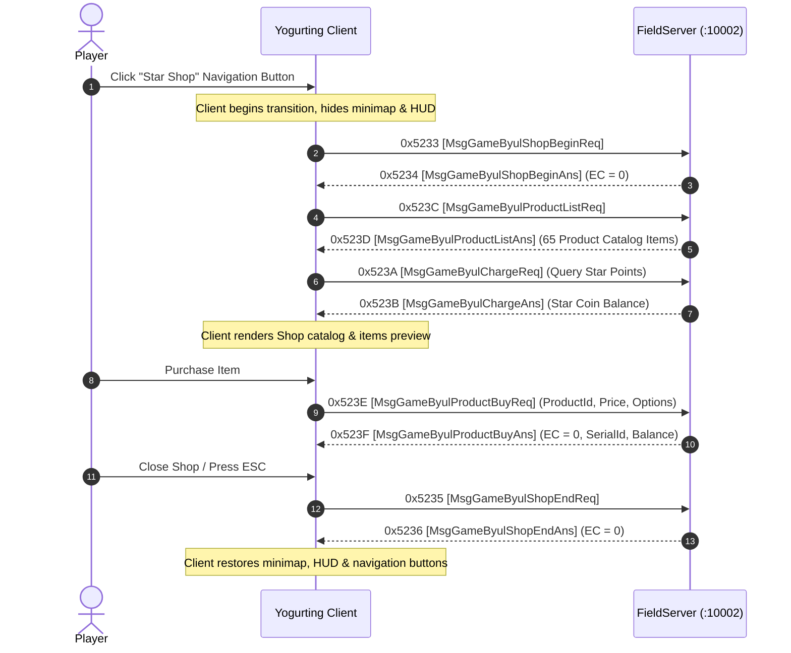

# Volume 6, Chapter 1: Star Cash Shop & Product Catalog Protocol

## 1. Star Cash Shop State Machine

The Star Cash Shop allows players to browse premium clothing, hairstyles, and buff items. The client and FieldServer execute the following lifecycle:



---

## 2. Opcode Specifications

### 1. Opcode 0x5233 (21043): `MsgGameByulShopBeginReq` / `0x5234` (21044): `MsgGameByulShopBeginAns`
* **Direction**: Client $\longrightarrow$ Server (`0x5233`) / Server $\longrightarrow$ Client (`0x5234`)
* **AnaYg Scripts**: [`21043.dms`](../dms/21043.dms), [`21044.dms`](../dms/21044.dms)
* **Delphi Handlers**: `TSchoolSession.sub_006BFFF8`, `TMsgGameByulShopBeginAns.Create` (`0x005A9A04`)

#### `MsgGameByulShopBeginAns` Payload (4 Bytes):
| Offset | Field Name | Type | Size | Description |
| :--- | :--- | :--- | :--- | :--- |
| `0x00` | `errorCode` | `Int32` | 4B | `0x00000000` = Success (Any non-zero value triggers client modal error dialog) |

---

### 2. Opcode 0x523C (21052): `MsgGameByulProductListReq` / `0x523D` (21053): `MsgGameByulProductListAns`
* **Direction**: Client $\longrightarrow$ Server (`0x523C`) / Server $\longrightarrow$ Client (`0x523D`)
* **Delphi Class**: `TMsgGameByulProductListAns` (`_Unit47.pas:005A9AC4`)
* **AnaYg Script**: [`21053.dms`](../dms/21053.dms)

#### Product Entry Format in Catalog (`byul_product` struct - 20 Bytes each):
```text
Offset +0:  Int32 productID   (Item Type ID, e.g. 1202420)
Offset +4:  Int64 price       (Star Coin / Point Price)
Offset +12: Int32 dp_option   (Display Category / Promo flag)
Offset +16: Int32 priceType   (1 = Star Points, 2 = Taff)
```

---

### 3. Opcode 0x5235 (21045): `MsgGameByulShopEndReq` / `0x5236` (21046): `MsgGameByulShopEndAns`
* **Direction**: Client $\longrightarrow$ Server (`0x5235`) / Server $\longrightarrow$ Client (`0x5236`)
* **Function**: Closes shop session and restores the game viewport.
* **Payload**: `Int32 errorCode` (`0`).
