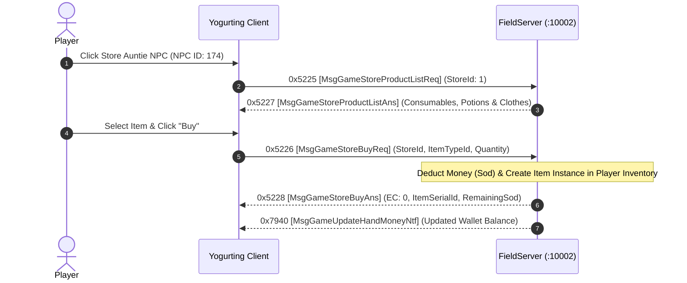

# Volume 6, Chapter 2: NPC Stores, Auntie Shops & Vending Transactions

## 1. NPC Store Interaction Flow



---

## 2. Opcode Specifications

### 1. Opcode 0x5225 (21029): `MsgGameStoreProductListReq` / `Ans` (0x5227)
* **Direction**: Client $\longrightarrow$ Server (`0x5225`) / Server $\longrightarrow$ Client (`0x5227`)
* **AnaYg Scripts**: [`21029.dms`](../dms/21029.dms), [`21031.dms`](../dms/21031.dms)
* **Delphi Handlers**: `TSchoolSession.sub_006C0150`, `TMsgGameStoreProductListAns.Create` (`0x005A9674`)

#### `MsgGameStoreProductListAns` Payload:
```text
Offset +0: Int32 storeId
Offset +4: UInt16 productCount
For each product:
  Offset +0: Int32 itemTypeId   (from ItemTable.txt)
  Offset +4: Int64 buyPrice     (in Sod)
  Offset +12: Int32 stockCount   (-1 for infinite)
```

---

### 2. Opcode 0x5226 (21030): `MsgGameStoreBuyReq` / `Ans` (0x5228)
* **Direction**: Client $\longrightarrow$ Server (`0x5226`) / Server $\longrightarrow$ Client (`0x5228`)
* **Delphi Handlers**: `TSchoolSession.sub_006C0284`, `TMsgGameStoreBuyAns.Create` (`0x005A9710`)

#### `MsgGameStoreBuyAns` Payload (24 Bytes):
| Offset | Field Name | Type | Size | Description |
| :--- | :--- | :--- | :--- | :--- |
| `0x00` | `errorCode` | `Int32` | 4B | `0x00000000` = Success, `0x00000002` = Insufficient Sod |
| `0x04` | `itemTypeId` | `Int32` | 4B | Purchased Item Type ID |
| `0x08` | `itemSerialId`| `Int64` | 8B | New Item Instance Serial ID |
| `0x10` | `remainingSod`| `Int64` | 8B | Player's updated hand money balance |
