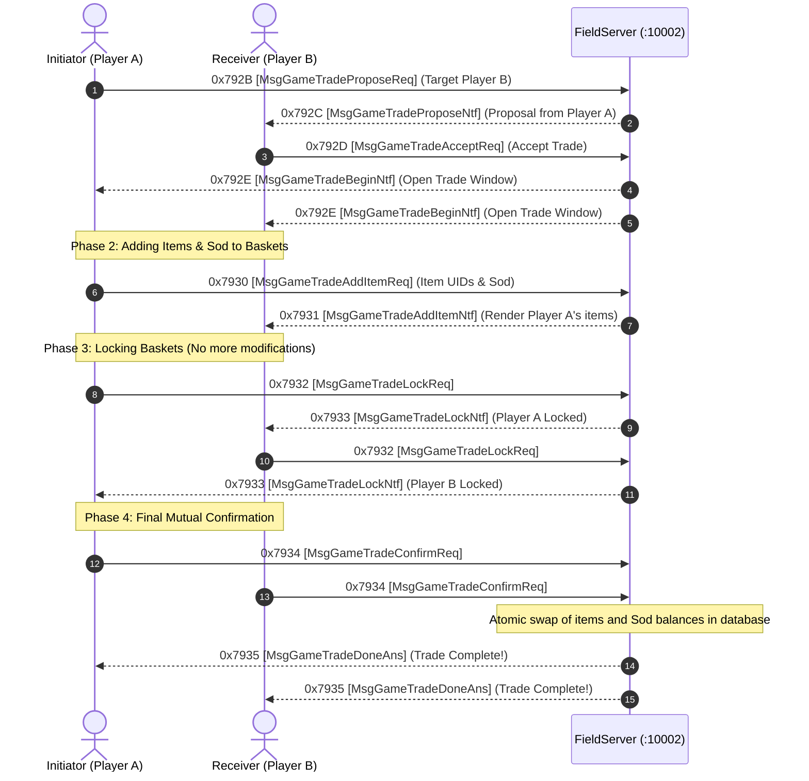

# Volume 6, Chapter 3: Player-to-Player Direct Trade Protocol

## 1. P2P Trading State Machine

The direct trading protocol uses a 4-step confirmation model to prevent trade scams and item duplication:

---

## 2. Trade Opcode Reference Table

| Opcode (Hex) | Opcode (Dec) | Canonical Name | Direction | Function |
| :--- | :--- | :--- | :--- | :--- |
| `0x792B` | `31019` | `MsgGameTradeProposeReq` | Client $\longrightarrow$ Server | Send trade request to nearby player. |
| `0x792C` | `31020` | `MsgGameTradeProposeAns` | Server $\longrightarrow$ Client | Delivery notification of trade proposal. |
| `0x792D` | `31021` | `MsgGameTradeAcceptReq` | Client $\longrightarrow$ Server | Accept incoming trade proposal. |
| `0x792E` | `31022` | `MsgGameTradeBeginNtf` | Server $\longrightarrow$ Client | Initializes 2-column trade basket UI. |
| `0x7930` | `31024` | `MsgGameTradeAddItemReq` | Client $\longrightarrow$ Server | Place item or Sod into trading basket. |
| `0x7931` | `31025` | `MsgGameTradeAddItemNtf` | Server $\longrightarrow$ Client | Synchronizes opponent's basket. |
| `0x7932` | `31026` | `MsgGameTradeLockReq` | Client $\longrightarrow$ Server | Lock basket to prevent changes. |
| `0x7933` | `31027` | `MsgGameTradeLockNtf` | Server $\longrightarrow$ Client | Update basket lock indicator. |
| `0x7934` | `31028` | `MsgGameTradeConfirmReq` | Client $\longrightarrow$ Server | Final click on "Trade" button. |
| `0x7935` | `31029` | `MsgGameTradeDoneAns` | Server $\longrightarrow$ Client | Complete atomic transfer & close UI. |
| `0x7936` | `31030` | `MsgGameTradeCancelReq` | Client $\longrightarrow$ Server | Cancel / Abort active trade. |
| `0x7937` | `31031` | `MsgGameTradeCancelAns` | Server $\longrightarrow$ Client | Return locked items to backpacks. |
