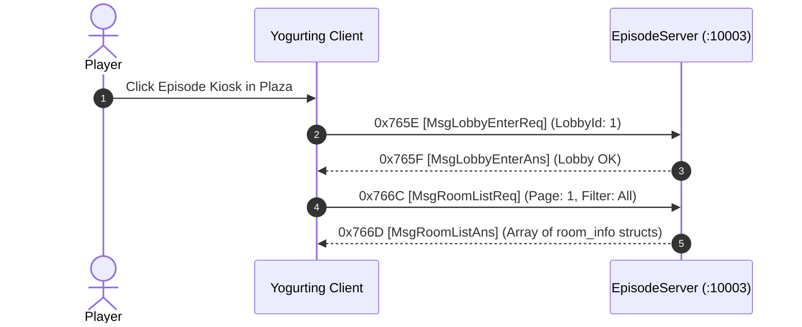

# Volume 7, Chapter 1: Episode Lobby & Room Listing Protocol

## 1. Episode Matchmaking Architecture

The **EpisodeServer** (`Port 10003`) manages instanced dungeon episodes, party matchmaking, waiting rooms, and grade rankings.



---

## 2. Opcode Specifications

### 1. Opcode 0x766C (30316): `MsgRoomListReq` / `Ans` (0x766D)
* **Direction**: Client $\longrightarrow$ Server (`0x766C`) / Server $\longrightarrow$ Client (`0x766D`)
* **AnaYg Scripts**: [`30316.dms`](../dms/30316.dms), [`30317.dms`](../dms/30317.dms)
* **Delphi Class**: `TMsgRoomListAns` (`_Unit47.pas:005AB628`)

#### `room_info` Sub-Structure in Room List (`struct.dms` - 64 Bytes):
```text
Offset +0:  UInt16 snRoom                 (Room Sequential Number)
Offset +2:  UInt16 idLobby                (Lobby ID)
Offset +4:  Byte   status                 (0 = Open, 1 = Full, 2 = In Game)
Offset +5:  Byte   padding                (0xCC)
Offset +6:  WStr[21] title                (UTF-16LE Room Title, 42 bytes)
Offset +48: UInt32 idEpisodeType          (Episode ID from EpTable.txt)
Offset +52: Byte   cntMaxUser             (Max Players: 1..8)
Offset +53: Byte   cntCurrentUser         (Active Players count)
Offset +54: Byte   cntTeam                (Number of Teams: 1 or 2)
Offset +55: Byte   bPassWord              (Password Protected: 0 or 1)
Offset +56: Byte   bPK                    (PvP Friendly Fire: 0 or 1)
Offset +57: Byte   bLimitMilk             (Potion Restriction: 0 or 1)
Offset +58: Byte   bWaiting               (Open for Joins: 0 or 1)
Offset +59: Byte   clearRate              (Clear Rank Multiplier)
Offset +60: Float32 scheduleCalorieEnter  (Entry Calorie cost)
Offset +64: Float32 scheduleCalorieConsume(Decay Calorie rate)
```
