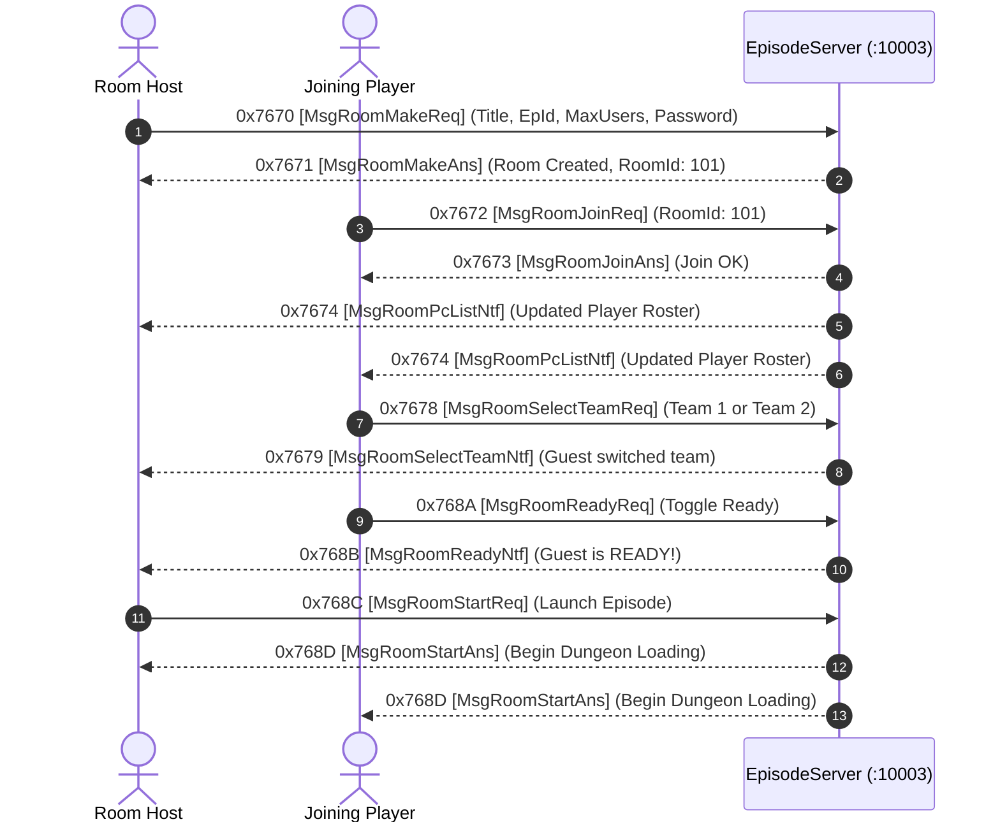

# Volume 7, Chapter 2: Waiting Room Management & Team Coordination

## 1. Waiting Room State Machine

---

## 2. Roster Serialization (`pc_info` Sub-Structure - 44 Bytes)

Defined in [`struct.dms`](../dms/struct.dms) and transmitted via `0x7674 (MsgRoomPcListNtf)`:

| Offset | Field Name | Type | Size | Description |
| :--- | :--- | :--- | :--- | :--- |
| `0x00` | `idChar` | `Int32` | 4B | Player Character ID |
| `0x04` | `name` | `WStr[13]` | 26B | UTF-16LE Character Name |
| `0x1E` | `gender` | `Byte` | 1B | `1` = Male, `2` = Female |
| `0x1F` | `grade` | `Byte` | 1B | School Year / Grade |
| `0x20` | `weapon` | `UInt16` | 2B | Currently Equipped Weapon Category |
| `0x22` | `idTeam` | `UInt16` | 2B | Team Assignment (`1` = Red / Team A, `2` = Blue / Team B) |
| `0x24` | `phone` | `Int32` | 4B | In-game Phone Number |
| `0x28` | `idPromotion` | `Int32` | 4B | Promotion / Title Rank ID |
