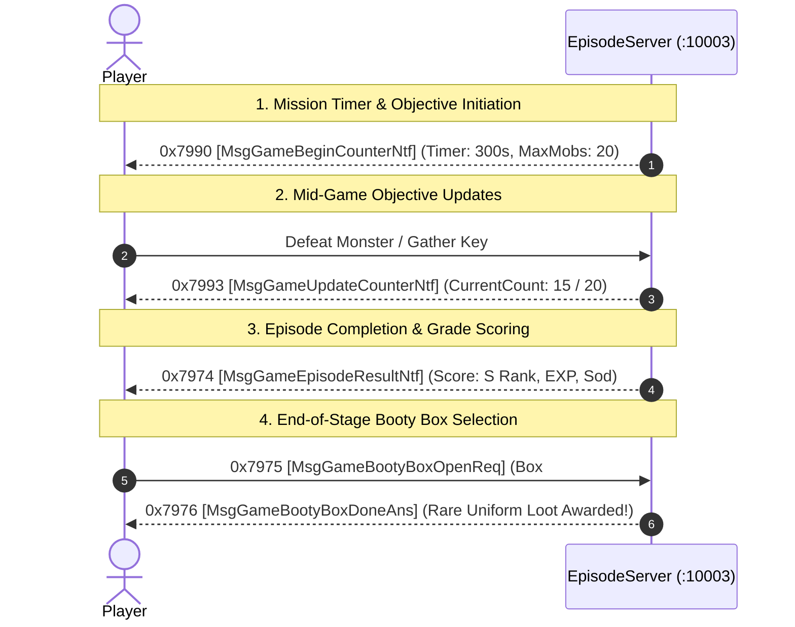

# Volume 7, Chapter 3: Episode Instance Progression, Objectives & Clear Ranking

## 1. Episode Dungeon Progression Lifecycle

---

## 2. Opcode Specifications

### 1. Opcode 0x7990 (31120): `MsgGameBeginCounterNtf` [カウンタ開始通知]
* **Direction**: Server $\longrightarrow$ Client
* **Delphi Class**: `TMsgGameBeginCounterNtf` (`_Unit47.pas:005AE8EC`)
* **AnaYg Script**: [`31120.dms`](../dms/31120.dms)
* **Payload (24 Bytes)**:
  * `0x00`: `Int32 Current` (Initial counter value, e.g. `0`)
  * `0x04`: `Int32 CounterType` (`1` = Monster Defeat Count, `2` = Timer Countdown)
  * `0x08`: `Int32 DescType` (UI Objective Icon / Prompt ID)
  * `0x0C`: `Int32 IconID` (HUD Graphic Index)
  * `0x10`: `Int32 Max` (Goal Target, e.g. `20` monsters or `300` seconds)
  * `0x14`: `Int32 Step` (Increment step)

---

### 2. Opcode 0x7993 (31123): `MsgGameUpdateCounterNtf` [カウンタ更新通知]
* **Direction**: Server $\longrightarrow$ Client
* **Payload (8 Bytes)**:
  * `0x00`: `Int32 CounterType`
  * `0x04`: `Int32 CurrentValue` (e.g. `19` / `20`)

---

### 3. Opcode 0x7974 (31092): `MsgGameEpisodeResultNtf` [エピソード結果通知]
* **Direction**: Server $\longrightarrow$ Client
* **Delphi Class**: `TMsgGameEpisodeResultNtf` (`_Unit47.pas:005AE2E8`)
* **Payload Structure (`episode_result_contents`)**:
  * Delivers overall stage clearance grade (`S`, `A`, `B`, `C`, `D`), clear time in milliseconds, max combo multiplier, team score, and base EXP / Sod payouts.
