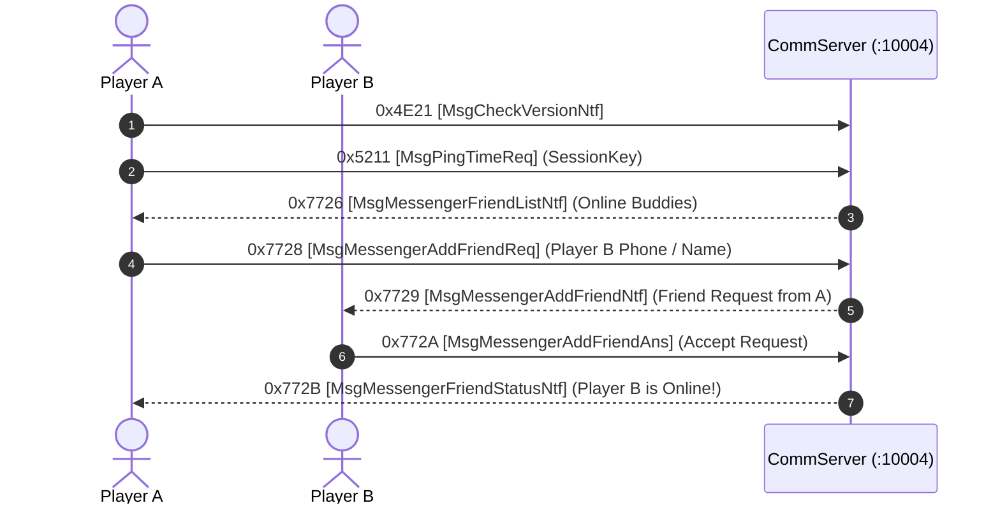

# Volume 8, Chapter 1: CommServer & Messenger Protocol (Port 10004)

## 1. CommServer Architecture

The **CommServer** (`Port 10004`) maintains continuous presence, buddy lists, whispers, and cross-field social messaging:

---

## 2. Opcode Specifications

### 1. Opcode 0x7726 (30502): `MsgMessengerFriendListNtf`
* **Direction**: Server $\longrightarrow$ Client
* **Delphi Class**: `TMsgMessengerFriendListNtf` (`_Unit47.pas:005ABA4C`)
* **AnaYg Script**: [`30502.dms`](../dms/30502.dms)
* **Payload Structure**:
  * Array of friend records containing `CharacterId`, `PhoneNumber`, `CharacterName`, `OnlineStatus` (`0`=Offline, `1`=Field, `2`=Episode), and `CurrentFieldId`.

---

### 2. Opcode 0x7759 (30553): `MsgCommHeartbeatNtf`
* **Direction**: Bidirectional
* **Function**: Transmitted every 30 seconds to maintain persistent NAT keep-alive and verify client presence.
